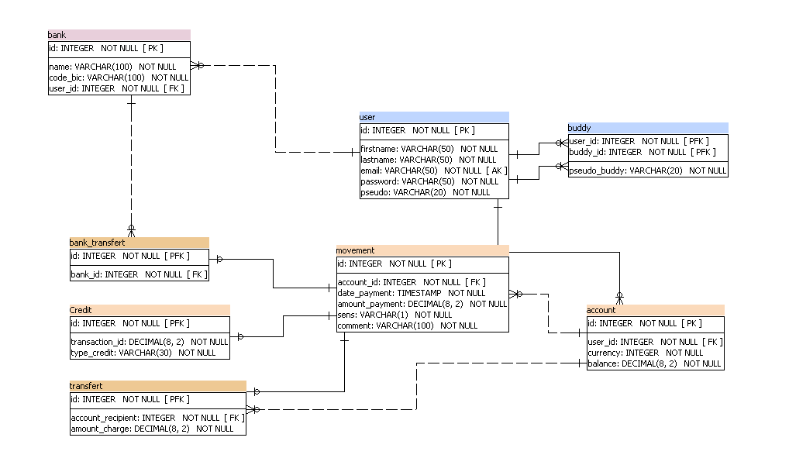

# Pay My Buddy
API REST application for managing payment. 
This app use SPRINT BOOT and the data are stored in a Mysql DB.

## Getting Started

These instructions will get you a copy of the project up and running on your local machine for development and testing purposes. See deployment for notes on how to deploy the project on a live system.

endpoint : https://localhost:8443/ Actuator : https://localhost:8443/actuator

### Prerequisites

What things you need to install the software and how to install them

- Java 1.8
- Maven 3.6.2
- Spring boot 2..2.6
- Mysql 8.0.17

### Installing
Run the sql commands drop.sql and create.sql.

Create a variable system JASYPT_ENCRYPTOR_PASSWORD that contains the private key to encrypt the password. The encrypted password is to change in the fiel application.properties

### Running App

mvn clean install
mvn clean verify (generate tests and test report)
mvn site (generate reportings)

### Testing
The app has unit tests and integration tests written. To run the test with maven execute the command mvn test in the folder with the pom.xml file.

